# Database Design And Performance Tuning

## Executive Summary
The objective of this project is to design and implement the Entity Relation Diagram for the IMDb
data set for movies and T.V. shows. This design can be used to explore and view information
about movies and T.V. shows. Motivation behind doing this project came after working on movies
database for class assignments. If a person wants to find details about any movie or show they have
to look at different places to get complete information. Data for this project is fetched from IMDb
website and is created as one stop destination for users to access the following information:
1. User can access list of movies and shows which are coming soon.
2. Region wise and language wise movies and shows can be found.
3. Type of display for the movies/shows can also be checked. For example, if the display is
original, it is just the trailer, display is 3-D version etc.
4. List of movies/shows labeled based on their run time minutes - video, short, movie, tv series,
tv mini series.
5. User can gets the details of tv shows about the total seasons and total episodes.
6. User can search for the list of movies and tv shows of their favorite actors/ actress, director,
producer, writer and other roles.
7. User can look at the average rating given to their movie/show of choice.

## ERD Design
SQL table consists of all the data in the IMDb database. For creating tables, Entity Relationship
Diagram is designed (ERD) to see the relationship between entity and its attributes. Records of
database are stored in relational database and data dictionary is one of its crucial component. Data
dictionary is created to describe the contents, format and structure of the database. It consists of
the name of the column, description, data type, size, identity. constraints of the table like keys,
unique, index, nulls etc. Relationship between the columns of the database can be used to access
the information and manipulate the database.<br>

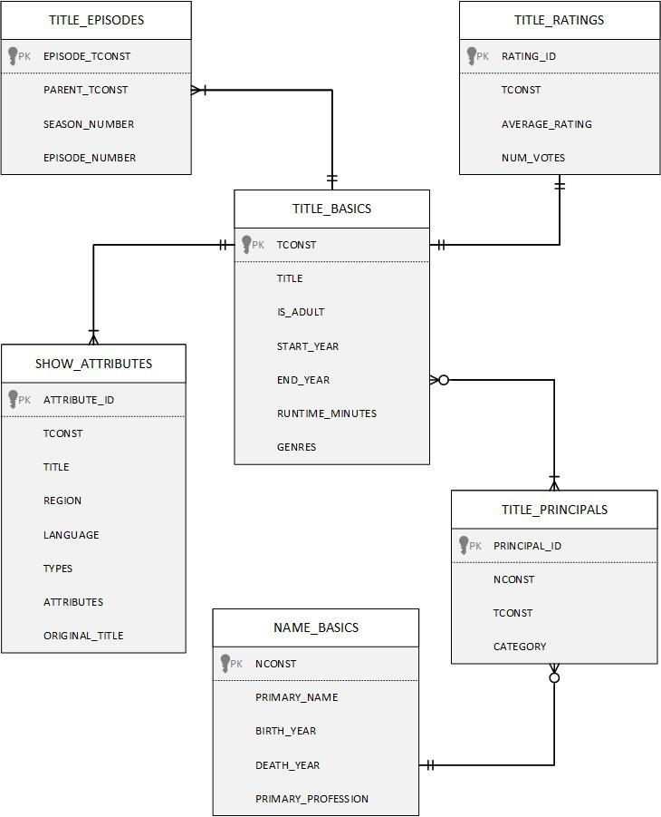

## Scripting
The data set was in tab separated format so to read it pandas library was used. Original data set
was huge and each table consisted of 7 million rows. Number of rows in TITLE BASICS and
NAME BASICS were limited to 15000 and data after 2019 was inserted into the tables, rest all the
tables were built on that. TITLE EPISODES consists of total number of episodes and total number
of seasons. One table had roles and other had names with no roles. We put relationship for both
with and without roles in TITLE PRINCIPALS table. We exported all tables to csv for syncing
purposes.

```
import cx_Oracle
cx_Oracle.init_oracle_client(lib_dir="instantclient_19_8")
dsn_tns = cx_Oracle.makedsn('reade.forest.usf.edu', '1521','cdb9')
conn = cx_Oracle.connect(user='DB372', password='<password>', dsn=dsn_tns)
cursor = conn.cursor()
```

```
import pandas as pd
import sys

sql='insert into TITLE_BASICS values(:1,:2,:3,:4,:5,:6,:7)'
n=0
m=0
dft = pd.read_csv('title.episode.tsv', sep='\t')

for df in pd.read_csv('title.basics.tsv', sep='\t', chunksize=5000):
	df = df.replace('\\N', '')
	print(n)
	for index, row in df.iterrows():
		if row['startYear'] == '' or int(row['startYear']) < 2015 or
		len(dft.loc[dft['tconst']==row['tconst']]) > 0 : continue
		li = [row['tconst'], row['originalTitle'], row['isAdult'],
 row['startYear'], row['endYear'] ,
 row['runtimeMinutes'], row['titleType']]
		try:
			cursor.execute(sql,li)
			m += 1
			print("inserted: ", m)
			if m >= 10000:
				conn.commit()
				conn.close()
				sys.exit(1)
		except Exception as e:
				print(row)
				print(str(e))
	n+=5000
	conn.commit()

conn.close()
```

## Data Exploration and Query Writing
In this section, the database would be investigated to understand the structure. For this we write some queries and check the output to understand if the initial setup was successful.

**Table 1 : title basics**<br>
According to the ERD shown in Fig 1, the table basic is the center which the others table connect.
Firstly, this table did not have primary key as a default shown in Fig 2 and the Fig 3 shows the
primary key, tconst, after being altered.

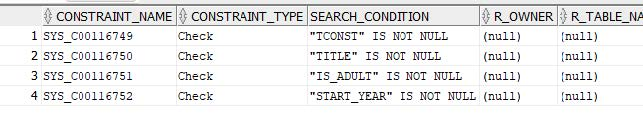

```
ALTER TABLE title_basics
ADD CONSTRAINT title_basics_pk
PRIMARY KEY (tconst);
```

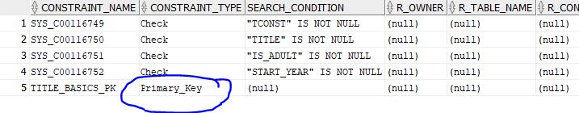

**Table 2 : title episode**<br>
Same pattern is applied to this table. However, there are duplicated data exist in this table shown
in Fig 4 with prevent from creating primary key. After delete it, Fig 5 show the primary key, which
is ep id. Surprisingly, parent tconst is the subset of tconst in title basic.

```
SELECT *
FROM title_episode
WHERE ep_id = 'epid000000000';
```

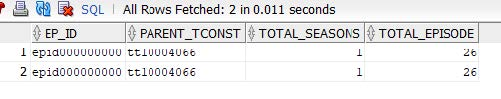

```
DELETE FROM title_episode
WHERE rowid not in (
SELECT MAX(rowid)
FROM title_episode
GROUP BY ep_id);
```

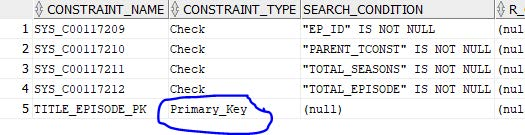

**Table 3 : show attributes**<br>
In contrast to table: title episode, there is no problem exist. Fig 6 show the primary key of this
table.

```
ALTER TABLE show_attributes
ADD CONSTRAINT show_attributes_pk
3RIMARY KEY (att_id);
```

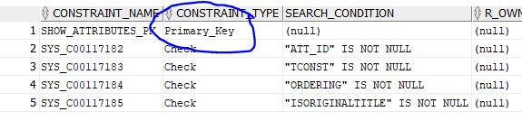

**Interesting Queries**<br>
This section shows a code snippet from the full report about writing some intereting queries.

1. Display movie name, people who are responsible with their roles, year of the movie,
and age restriction.

```
SELECT
	tb.title,
	nb.first_name,
	nb.last_name,
	tp.role,
	tb.start_year,
	tb.is_adult
FROM
	title_basics tb
	INNER JOIN title_principals tp
	USING (tconst)
	INNER JOIN name_basics nb
	USING (nconst)
ORDER BY tb.start_year DESC, nb.first_name;
```

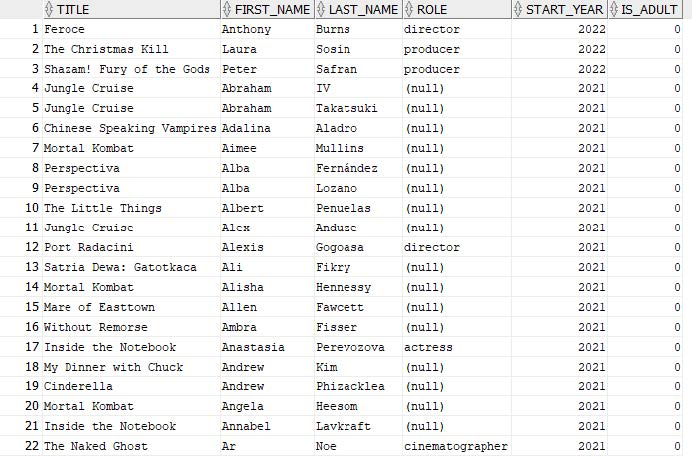

## Performance Tuning
This section explores various performance tuning methods which can increase query speed and efficiency.
The main purpose of database tuning is to increase query speed. Database tuning is a more
broader term which includes optimization, database management system applications and database
environment configuration which includes OS optimizer, CPU single and multi-threading, memory
etc. In this project, we will be specifically looking at database performance tuning techniques like
indexing, partitioning, parallel execution etc.

**Indexing**<br>
Let’s start-off with indexing. Indexes are widely used to quickly search through the data without
having to search every single row in a table when a database is accessed. Indexes can be created
using a single or multiple columns of a database table, which provides both rapid random lookups
and efficient access of ordered records.

**Function-Based Indexing**<br>
Indexing is performing a full scan, this can be further optimized by using Functionbased
Indexing. In Function-Based Indexing, we use something called a range scan, instead of full
scan, by doing this the query will be faster where the optimizer does complex querying.

**Parallel Execution**<br>
In this section, the CUSTOMER table is used to show how parallelism works. First of all we begin
by creating a table and executing a simple query. Then we proceed to enable parallelism on the
same query and execute again.

**Transitions in More Complex Parallel Queries**<br>
In this section, we use the MOVIES tale to show various transitions like parallel-to-parallel and
parallel-to-serial using complex queries. In this example we see the best transition which is
parallel-to-parallel, showing we had no bottlenecks for this processing.

**Partitioned Tables**<br>
In this section, we show how partitioning works. We will write some interesting queries to test out
how the range partition works and see the partitioned result.

## Data Visualization with R
According to the difficulty of syncing the database to Rstudio, we decide to export the query result
shown below in excel file. Then we decide to do the linear regression test by Rstudio with the table
data.

```
SELECT
	tb.title,
	tr.avarage_raing,
	tr.num_votes
FROM
	title_basics tb
	INNER JOIN title_ratings tr
	USING (tconst)
WHERE tr.num_votes > 100
ORDER BY tr.avarage_raing DESC;
```

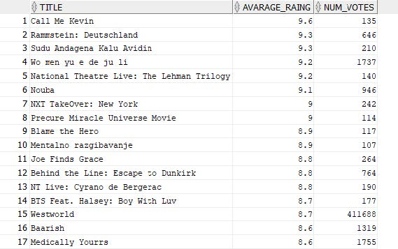

The data show IMDB score, number of voter, restriction age of movies and number of location
which the movie goes aboard. After that, we perform the regression model test by comparing
hypothesis test of 6 different models. Denote Y = IMDB ranking, X1 = number of voter .

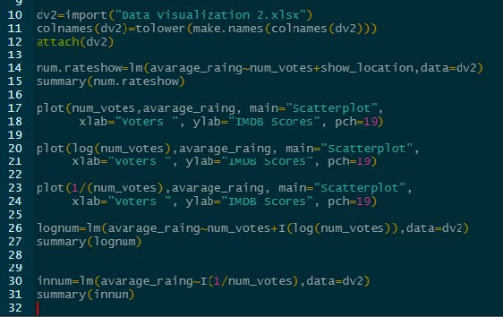

> Y = B0 + B1X1

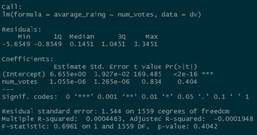

According to the P-value and R-squared, they are both surprisingly ugly value. We cannot assume
or identify any relationship on them. Therefore, we decide to do nonlinear model which are ln(x)
model and inverse x model .

> ln(x) model

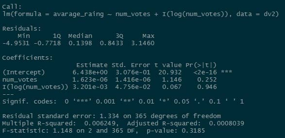

> Inverse X model

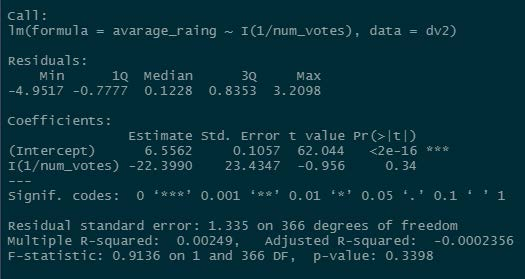

**Analysis Results**<br>
According to the results, both of the functions still contain ugly values. It means the relationship of
those X1 and Y is very hard to determine. The relationship could be very more complex or it is not
related. However, we could imply that the rating of the movies might not explain in the numeric
function because the human emotion is too bias.

## Conclusion
One of the interesting projects that I did which helped me understand the entire database design and management pipeline starting with the ERD, scripting and querying to more advanced aspects of the design like performance tuning and we also got a chance to do some data analytics with R where we build ML models and draw new insights.


